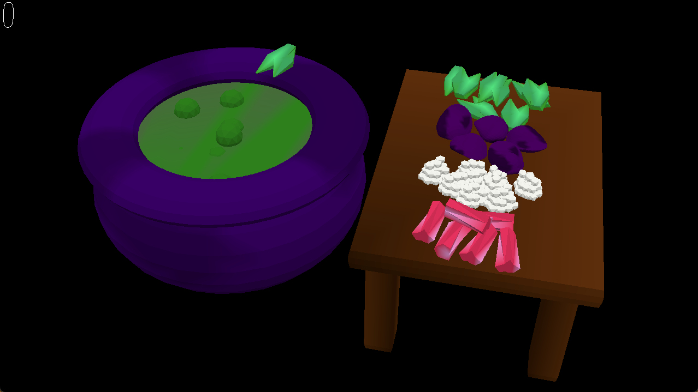

# Potion Panic

Author: Max Levine

Design: This game is similar to Worldle, except with a sound-memory twist that gives it a unique challenge. It also has a striking atmosphere.

Screen Shot:

How To Play:

Listen carefully to the sequence of sounds that you need to recreate. Then, press the 1-4 keys to drop the ingredients into the cauldron. Each ingredient will make a sound not only based on what it is, but also the order that it was placed in. An ingredient dropped in 1st can make a completely different sound if dropped in 2nd! You have to recreate the goal sound sequence for a successful recipe. You lose points per failed attempt. You can press space to end the attempt, rehear the sequence, and earn back some points for the unplaced ingredients. It starts out with two-ingredient recipes, but it becomes more difficult with longer sequences of ingredients to figure out, but with more potential for points. All the ingredients are various kinds of laxatives.

This game was built with [NEST](NEST.md).
